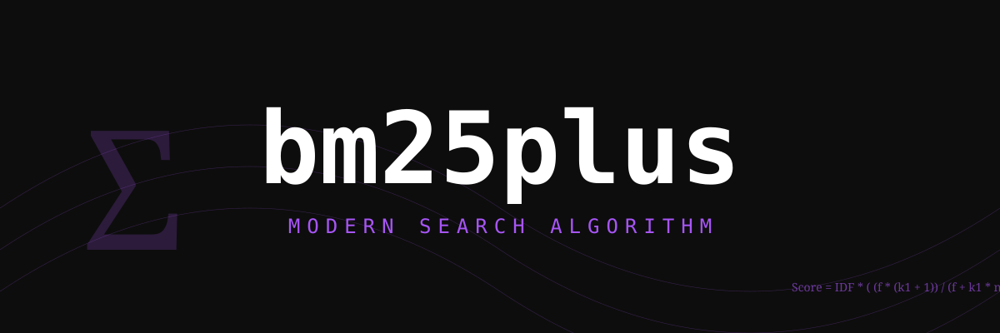

# bm25plus 🚀

<p align="center">
  
</p>

### Modern Search, No Drama.

Listen, searching shouldn't be a chore. It shouldn't lock up your main thread, it shouldn't be a black box, and it definitely shouldn't be slow. We've built **`bm25plus`** because we believe in search for humans—fast, typed, and respectful of your user's experience.

Why BM25+? Because standard BM25 can be a bit of a bully to long documents. BM25+ fixes that with a simple `delta` parameter that levels the playing field. It's the search algorithm you deserve, implemented in a way that makes sense in 2026.

---

## 🏗 Why you'll love it:

- **Algorithmically Superior:** BM25+ implementation (Okapi BM25 with a delta constant).
- **Thread-Friendly:** Offload the heavy lifting to Web Workers with a built-in executor.
- **Persistent:** Keep your index alive across reloads with IndexedDB (powered by Dexie).
- **Type-Safe:** First-class TypeScript support. If it's not typed, it doesn't exist.
- **Clean & Lean:** No "enterprise" bloat. Just the code you need to build great things.

## 🚀 Quick Start

```bash
pnpm add bm25plus
```

```typescript
import { BM25Index } from 'bm25plus';

const index = new BM25Index();

await index.addDocument({
  id: '1',
  fields: {
    title: 'The Future of Search',
    content: 'BM25+ is a modern ranking algorithm for information retrieval.'
  }
});

const results = await index.search('ranking algorithm');
console.log(results); // [{ id: '1', score: 2.14... }]
```

## 📚 Documentation

Dive deeper into our [Guide](./docs/guide/index.md) or explore the [API Reference](./docs/api/index.md).

---

### Philosophy

We're inspired by the clean, functional vibes of Anthony Fu and the enthusiastic clarity of Benjamin Goertzel. We build tools that feel like a friendly chat, but perform like a high-end machine.

Let's build something cool together. 🚀
